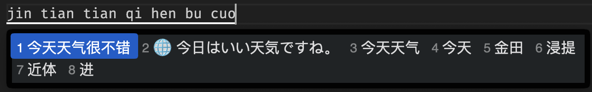

[中文文档点此查看](README_CN.md)

# RIME Ollama Translator

A [RIME](https://rime.im/) input method extension based on Ollama that provides real-time Chinese to Japanese translation.




## Features

- 🚀 Real-time Translation: Automatically provides Japanese translation candidates when typing Chinese
- 🤖 AI-Powered: Uses Ollama local large language models for translation
- 💾 Smart Caching: Automatically caches translation results for improved response speed
- 🔧 Configurable: Supports custom models, timeout settings, and other parameters
- 📝 Logging: Optional debug logging functionality

## System Requirements

- RIME input method framework
- Ollama service (running locally)

## Installation

1. **Install Ollama**
   ```bash
   # macOS
   brew install ollama
   # Start Ollama service
   ollama serve
   ```
2. **Download Model**
   ```bash
   # Download default model (gemma3:1b)
   ollama pull gemma3:1b
   ```
3. **Configure RIME**
   - Copy `rime_ollama_translator.lua` to your RIME configuration directory
   - Add the following to your RIME configuration file:
   ```yaml
   # Add to your input scheme configuration file
   filters:
     - lua_filter@*rime_ollama_translator
   ```

## Configuration Options

In the `rime_ollama_translator.lua` file, you can modify the following settings:

```lua
local config = {
    host = "http://127.0.0.1:11434",  -- Ollama service address
    model = "gemma3:1b",              -- Model name to use
    min_length = 2,                   -- Minimum translation length
    timeout = 15,                     -- Request timeout (seconds)
    debug = false,                    -- Enable debug logging
    debounce_delay = 1.8,            -- Debounce delay time
    prompt = "请将中文「%s」翻译成自然口语的日语，仅输出翻译结果，不要解释"
}
```

## Usage

1. Start RIME input method
2. Type Chinese text
3. When the input length reaches the configured minimum length, Japanese translation candidates will automatically appear
4. Translation results are marked with the 🌐 icon and appear as the second candidate in the list

## Supported Models

Theoretically supports any Ollama model. Recommended models:
- `gemma3:1b` (default, lightweight and fast)
- `qwen3:1.7b` (Chinese-friendly)

## Troubleshooting

### Common Issues

1. **Translation not working**
   - Check if Ollama service is running
   - Verify model is downloaded (`ollama list`)
2. **Slow response**
   - Try using a smaller model
   - Adjust the `timeout` parameter
   - Check system resource usage
3. **Enable debug logging**
   - Change `debug = false` to `debug = true` in configuration
   - Check `/tmp/rime_ollama_translator.log` file

### Log Files

Debug logs are saved to `/tmp/rime_ollama_translator.log`, including:
- Translation request details
- API response content
- Error messages

## Performance Optimization

- **Caching Mechanism**: Translations of identical text are cached to avoid duplicate requests
- **Minimum Length Limit**: Only translates text that meets the minimum length requirement, reducing invalid requests
- **Timeout Control**: Prevents long waiting times for responses

## License

This project is licensed under the MIT License.

## Contributing

Issues and Pull Requests are welcome!

## Changelog

### v0.1.0
- Initial release
- Support for Chinese to Japanese translation
- Implemented caching mechanism
- Added configuration options