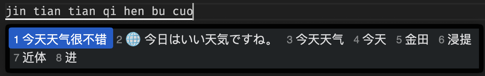

# RIME Ollama 翻译器

一个基于 Ollama 的 [RIME](https://rime.im/) 输入法扩展，能够实时将中文翻译成日语。

效果截图：



## 功能特性

- 🚀 实时翻译：输入中文时自动提供日语翻译候选
- 🤖 AI 驱动：使用 Ollama 本地大语言模型进行翻译
- 💾 智能缓存：自动缓存翻译结果，提高响应速度
- 🔧 可配置：支持自定义模型、超时时间等参数
- 📝 日志记录：可选的调试日志功能

## 系统要求

- RIME 输入法框架
- Ollama 服务（本地运行）

## 安装步骤

1. **安装 Ollama**
   ```bash
   # macOS
   brew install ollama
   # 启动 Ollama 服务
   ollama serve
   ```
2. **下载模型**
   ```bash
   # 下载默认模型（gemma3:1b）
   ollama pull gemma3:1b
   ```
3. **配置 RIME**
   - 将 `rime_ollama_translator.lua` 复制到你的 RIME 配置目录下的`lua`目录中
   - 在你的 RIME 配置文件中添加以下内容（以下是使用RIME ICE的方式）：
   ```yaml
   # 在你的输入方案配置文件中添加
   filters:
     - lua_filter@*rime_ollama_translator
   ```

## 配置选项

在 `rime_ollama_translator.lua` 文件中，你可以修改以下配置：

```lua
local config = {
    host = "http://127.0.0.1:11434",  -- Ollama 服务地址
    model = "gemma3:1b",              -- 使用的模型名称
    min_length = 2,                   -- 最小翻译长度
    timeout = 15,                     -- 请求超时时间(秒)
    debug = false,                    -- 是否启用调试日志
    debounce_delay = 1.8,            -- 防抖延迟时间
    prompt = "请将中文「%s」翻译成自然口语的日语，仅输出翻译结果，不要解释"
}
```

## 使用方法

1. 启动 RIME 输入法
2. 输入中文文本
3. 当输入长度达到配置的最小长度时，会自动显示日语翻译候选
4. 翻译结果会以 🌐 图标标识，出现在候选列表的第二位

## 支持的模型

理论上支持任何 Ollama 模型，推荐使用：
- `gemma3:1b`（默认，轻量快速）
- `qwen3:1.7b`（中文友好）

## 故障排除

### 常见问题

1. **翻译不工作**
   - 检查 Ollama 服务是否正在运行
   - 确认模型已下载（`ollama list`）
2. **响应缓慢**
   - 尝试使用更小的模型
   - 调整 `timeout` 参数
   - 检查系统资源使用情况
3. **启用调试日志**
   - 将配置中的 `debug = false` 改为 `debug = true`
   - 查看 `/tmp/rime_ollama_translator.log` 文件

### 日志文件

调试日志保存在 `/tmp/rime_ollama_translator.log`，包含：
- 翻译请求详情
- API 响应内容
- 错误信息

## 性能优化

- **缓存机制**：相同文本的翻译会被缓存，避免重复请求
- **最小长度限制**：只翻译达到最小长度的文本，减少无效请求
- **超时控制**：防止长时间等待响应

## 许可证

本项目采用 MIT 许可证。

## 贡献

欢迎提交 Issue 和 Pull Request！

## 更新日志

### v0.1.0
- 初始版本发布
- 支持中文到日语翻译
- 实现缓存机制
- 添加配置选项 